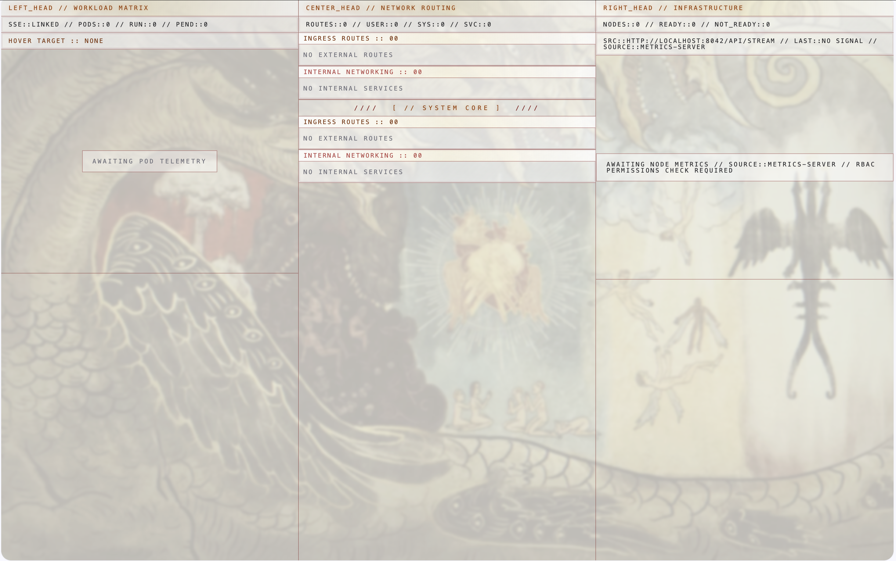
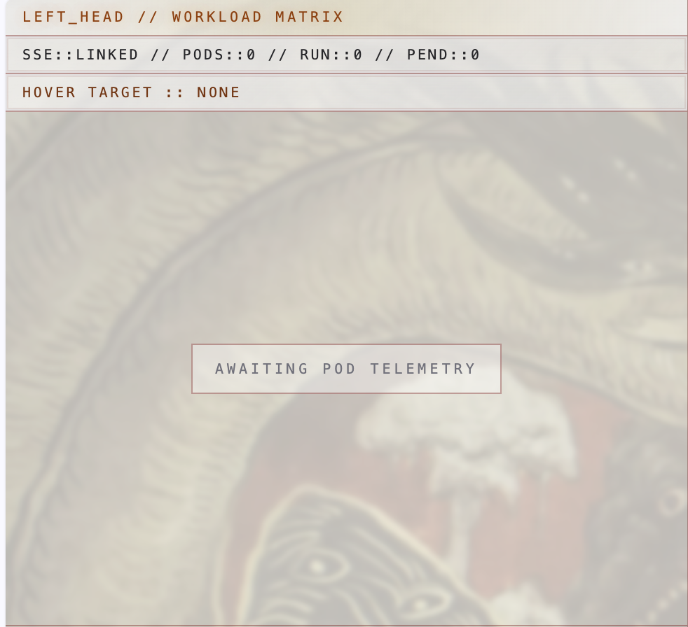
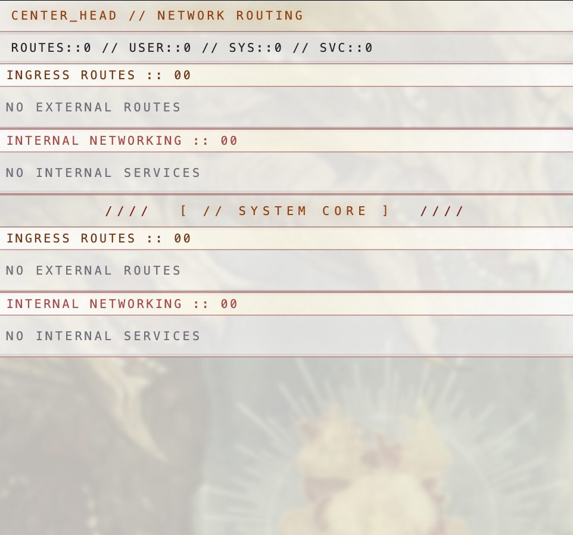
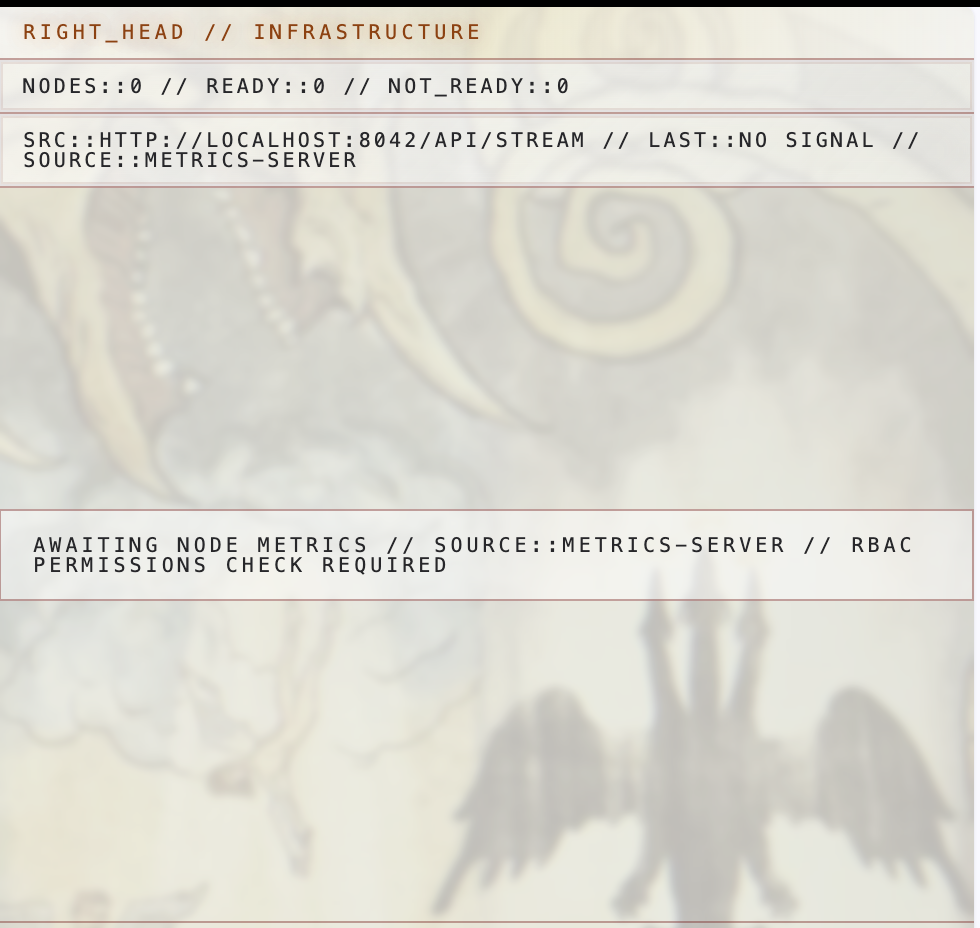

# Ghidorah


Status: beta.

Ghidorah is a purpose-built Kubernetes telemetry surface for watching workloads, services, ingress routes, and node health in one dense tactical view. It runs as a small Go backend plus a Svelte frontend, and it is designed to stay opinionated instead of becoming a blank observability canvas.



## What It Shows

Ghidorah organizes cluster state into three perspectives:







- Workloads: pods, phases, and grouped deployments.
- Network: services, ingress routes, and host-to-service mappings.
- Infrastructure: node readiness plus CPU and memory pressure.

## How It Works

The Go process under `cmd/ghidorah` connects to Kubernetes, watches cluster events, polls node metrics, and exposes a server-sent events stream at `http://localhost:8042/api/stream`. The frontend in `frontend/` opens that stream and renders the live cluster state.

## Getting Started

### Backend

Run the Go binary from the repository root:

```sh
go run ./cmd/ghidorah
```

### Frontend

Run the Svelte app from `frontend/`:

```sh
cd frontend
npm install
npm run dev
```

## Build

The frontend can be validated with:

```sh
cd frontend
npm run check
npm run build
```

## Repository Layout

- `cmd/ghidorah`: application entrypoint.
- `internal/cluster`: Kubernetes clients, informers, and metrics polling.
- `internal/server`: HTTP and SSE delivery.
- `internal/events`: shared event types and event bus.
- `frontend`: Svelte UI.
- `assets`: screenshots used in this README.
- `icons`: project icon artwork.

## Notes

- This repository is currently on beta.
- The UI expects the backend stream at `http://localhost:8042/api/stream`.
